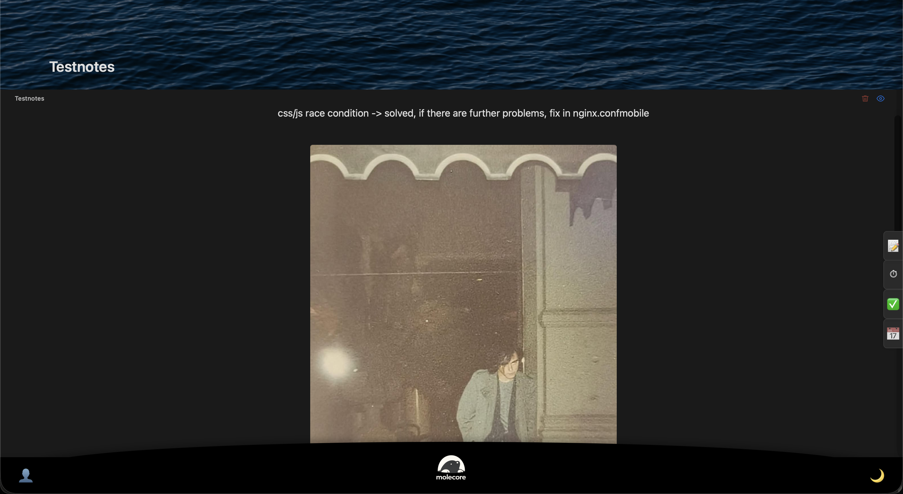

# Molecore

A minimalist, self-hosted block-based note-taking application with Keycloak authentication developed by me out of frustration with current note tools like Obsidian or Notion...



## Features

- Rich content block types: Text, Headers, Lists, Code, Tables, Images, Audio, Files, Embeds
- Hierarchical pages with subpages
- various optional tools like notepad, calendar, focus-timer, to-do list, dashboard page
- Multi-user support with isolated workspaces (via Keycloak/JWT)
- File uploads with user quotas (20 MB per file, 500 MB per user) and cleanup tool for unused files
- No annoying AI features, cooperation features, databases, templates..just your workspace
- Free and open source

## Tech Stack

**Frontend:**
- TypeScript + EditorJS + Keycloak-js
- Vite

**Backend:**
- Python + FastAPI + SQLAlchemy + python-jose (JWT validation)
- PostgreSQL

## Installation

Prepared for Docker + Nginx deployment with Keycloak authentication.

1. Setup your Keycloak-Server
2. Clone this Repo
3. Configure environment variables in `.env` (see `.env.example`)
4. Create `frontend/.env` with your Keycloak config (required for the frontend build):
   ```
   VITE_KEYCLOAK_URL=https://your-keycloak-server.com
   VITE_KEYCLOAK_REALM=your-realm
   VITE_KEYCLOAK_CLIENT_ID=your-client-id
   ```
5. Run `docker-compose up -d --build`
6. Have fun

## Configuration

### Upload Limits

Default limits (configurable in `backend/main.py`):
- **Max file size**: 20 MB per upload
- **Max storage per user**: 500 MB total

### File Storage

User uploads are stored in:
```
backend/uploads/{user_id}/
```

Each user has an isolated directory for their uploads.


## Upcoming Features and Fixes

- MacOS App with offline feature (probably via sync down and sync up button to avoid sync problems)


## License

AGPL-3.0 - see LICENSE file for details

## Acknowledgments

- Built with [EditorJS](https://editorjs.io/)
- Authentication via [Keycloak](https://www.keycloak.org/)
- Backend powered by [FastAPI](https://fastapi.tiangolo.com/)
